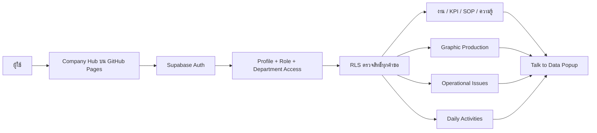
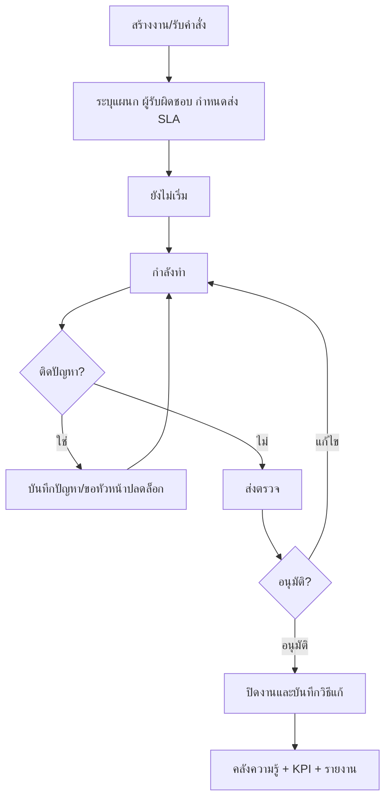
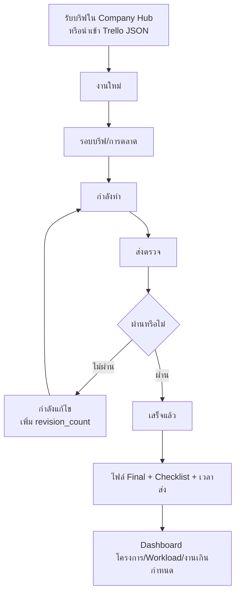
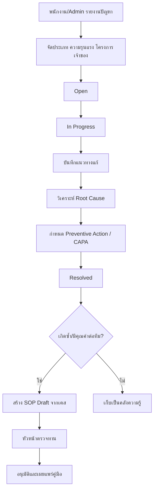
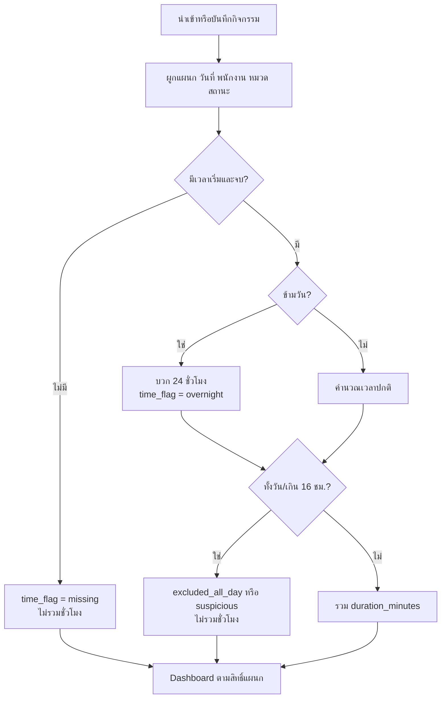
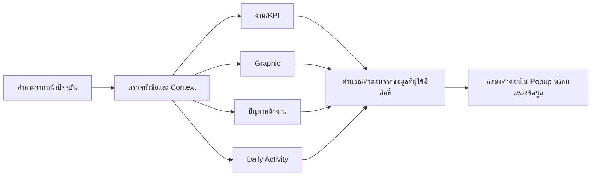

# Company Hub — ภาพรวมระบบและ Flow การทำงาน

อัปเดต: 29 สิงหาคม 2026

## 1. เป้าหมายของระบบ

Company Hub เป็นศูนย์กลางการทำงานของบริษัท ตั้งแต่รับงาน มอบหมาย ติดตามผล วัด KPI บันทึกปัญหาหน้างาน วิเคราะห์สาเหตุ สร้างคู่มือ และควบคุมสิทธิ์การมองเห็นตามบทบาท/แผนก

ข้อมูลจริงเก็บใน Supabase และใช้ Row Level Security (RLS) ควบคุมสิทธิ์ ไม่ฝังข้อมูลพนักงานหรือปัญหาหน้างานไว้ในไฟล์ GitHub Pages

## 2. ภาพรวมสถาปัตยกรรม

## 3. โมเดลสิทธิ์

สิทธิ์ของผู้ใช้เกิดจาก 4 ส่วนร่วมกัน:

1. `role` — พนักงาน (`staff`), หัวหน้า (`lead`), ผู้บริหาร (`exec`), ผู้ดูแล (`admin`)
2. `department_code` — แผนกหลัก
3. `profile_departments` — แผกเสริมที่มองเห็น และค่า `can_manage`
4. RLS — ฐานข้อมูลตรวจซ้ำทุกครั้ง แม้ผู้ใช้พยายามเรียก API โดยตรง

| บทบาท | มุมมองหลัก | สิทธิ์สำคัญ |
|---|---|---|
| พนักงาน | งานของฉัน, บอร์ดแผนก, กิจกรรมที่ได้รับสิทธิ์ | รับ/อัปเดตงานตนเอง ดูข้อมูลเฉพาะแผนกที่อนุญาต |
| หัวหน้างาน | Dashboard ทีม, KPI, รายงาน, Graphic/Issue ตามแผนก | มอบหมาย ตรวจงาน แก้ข้อมูลของแผนกที่ `can_manage` |
| ผู้บริหาร | Dashboard ทั้งบริษัท, ปัญหา, KPI, ทุกแผนก | เห็นภาพรวมและกำหนดสิทธิ์ผู้ใช้ |
| ผู้ดูแลระบบ | ทุกหน้าและการตั้งค่า | จัดการบทบาท แผนก การนำเข้า และการลบข้อมูล |

## 4. Flow งานทั่วไป

## 5. Flow Graphic Production

ข้อมูลหลัก: `graphic_projects`, `graphic_jobs`, `graphic_job_files`, `graphic_job_checklist_items`, `graphic_job_events`

## 6. Flow ปัญหาหน้างานสู่คู่มือ

Dashboard ปัญหาต้องตอบได้อย่างน้อย:

- ปัญหาเกิดจากหมวดใด/โครงการใดมากที่สุด
- Critical/High ที่ยังไม่ปิดมีอะไรบ้าง
- เวลาแก้เฉลี่ยและแนวโน้ม
- วิธีแก้ที่ใช้บ่อย
- เคสใดมี Root Cause/CAPA ครบและพร้อมสร้าง SOP

## 7. Flow Daily Activity

## 8. Flow Talk to Data

ปุ่ม Talk to Data อยู่ทุกหน้าและเปิดเป็น Popup ผู้ใช้จึงไม่ต้องเปลี่ยนหน้า ระบบตอบจากข้อมูลที่โหลดผ่าน RLS แล้วเท่านั้น

หมายเหตุ: เวอร์ชันปัจจุบันเป็น Data Query แบบกำหนดตรรกะ ไม่ได้ส่งข้อมูลลับไปยัง AI ภายนอก หากต้องการภาษาธรรมชาติเต็มรูปแบบ ควรเพิ่ม Edge Function ฝั่ง Server ที่ตรวจ JWT/RLS และไม่เปิด API key ในหน้าเว็บ

## 9. ตารางและ Migration

| Migration | ความรับผิดชอบ |
|---|---|
| 001–004 | โครงสร้างงาน, โปรไฟล์, RBAC, RLS และ normalized workspace |
| 005 | Operational Issues |
| 006 | Root Cause / Preventive Action / Issue-to-SOP |
| 007 | Graphic Production + Trello import |
| 008 | Daily Activities + duration normalization + RLS |

## 10. ลำดับเปิดใช้งาน Production

1. รัน Migration 008 ใน Supabase
2. นำเข้าข้อมูล Daily Activity ผ่าน `import_daily_activities(jsonb)` ด้วยบัญชีผู้ดูแล
3. ตรวจจำนวนข้อมูลและผลรวมชั่วโมงที่ผ่านการคัดกรอง
4. ทดสอบบัญชีพนักงาน หัวหน้า ผู้บริหาร และ Admin อย่างละหนึ่งบัญชี
5. ตรวจ RLS โดยยืนยันว่าแต่ละบัญชีไม่เห็นแผนกที่ไม่ได้รับสิทธิ์
6. Deploy GitHub Pages
7. ล้างข้อมูลพนักงาน/ปัญหาจาก Git history เดิม หรือเปลี่ยน repository เป็น private จนกว่าจะล้างเสร็จ

## 11. Acceptance Checklist

- [ ] ทุกหน้ามีปุ่ม Talk to Data และเปิดเป็น Popup
- [ ] Graphic Production แสดงงานจากฐานข้อมูลครบทุกหน้า pagination
- [ ] Daily Activity ไม่ฝังข้อมูลบุคคลใน HTML/JavaScript
- [ ] ปัญหาหน้างานไม่ฝังข้อมูลใน public bundle
- [ ] พนักงานเห็นเฉพาะงานตนเอง/แผนกที่อนุญาต
- [ ] หัวหน้าจัดการได้เฉพาะแผนกที่ `can_manage`
- [ ] ผู้บริหารเห็น Dashboard รวมและหน้าจัดการสิทธิ์
- [ ] Issue สามารถสร้าง SOP Draft ได้หลังมี Root Cause และ Preventive Action
- [ ] รายการเวลา all-day หรือเกิน 16 ชั่วโมงไม่ถูกรวมในยอดชั่วโมง
- [ ] ไม่มี JavaScript error ใน Desktop และ Mobile
