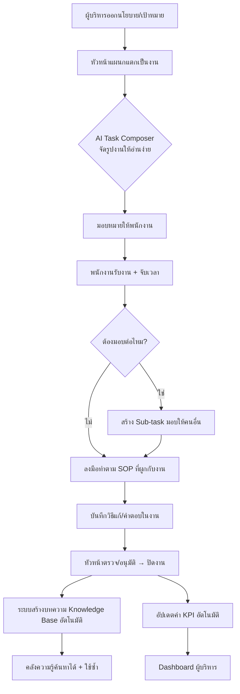
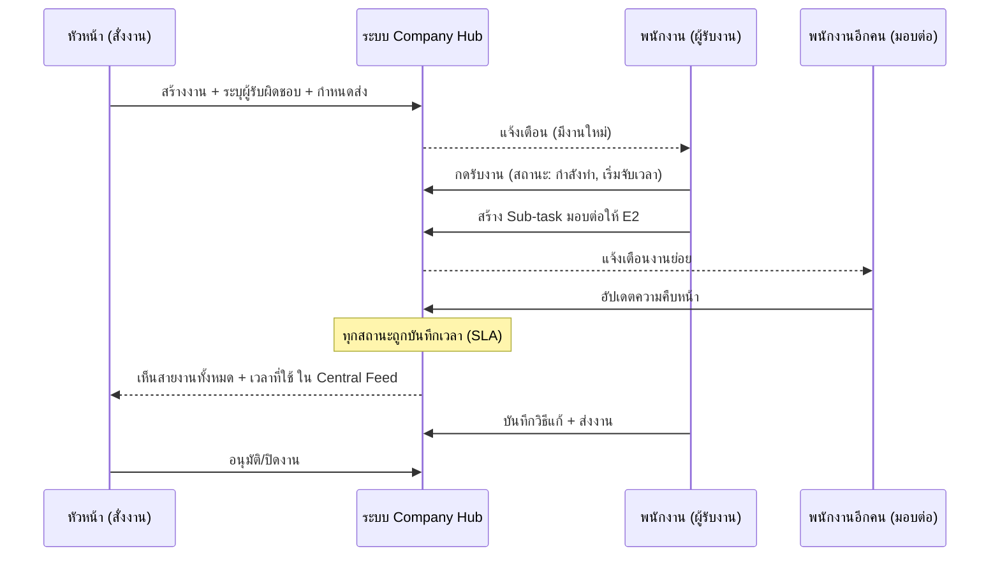
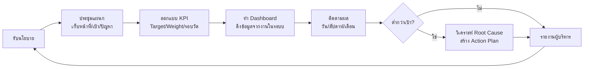
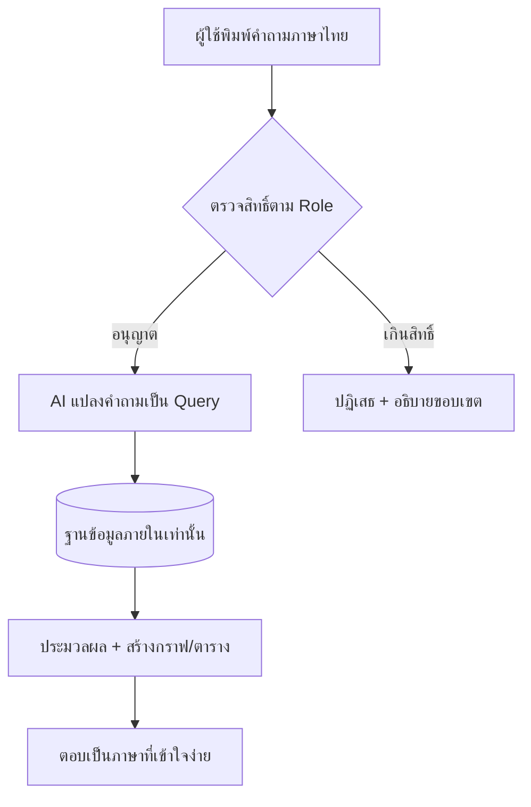
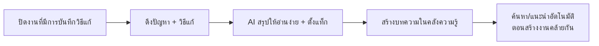

# Flow การทำงานของระบบ (Workflow)

เอกสารนี้อธิบายเส้นทางการทำงานหลักของระบบ พร้อมไดอะแกรม (Mermaid) — เปิดดูใน VS Code (ติดตั้งส่วนขยาย Markdown Preview Mermaid) หรือ GitHub จะเรนเดอร์ให้อัตโนมัติ

---

## 1. Flow ภาพรวม: จากนโยบายผู้บริหาร → งาน → วัดผล

---

## 2. Flow การมอบหมายและตามงาน (ตอบปัญหา "สั่งไปไม่รู้ใครทำ/ใช้เวลาเท่าไหร่")

**ผลลัพธ์:** หัวหน้าและผู้บริหารเห็นตลอดว่า *ใครทำ อยู่สถานะไหน ใช้เวลาไปเท่าไหร่ และค้างที่ขั้นตอนใด* — รวมถึงงานที่ถูกมอบต่อหลายทอด

---

## 3. Flow วงจร KPI (อ้างอิง Workflow แผนก KPI จริง)

---

## 4. Flow Talk to Data (ถามข้อมูลภายใน)

> ข้อสำคัญ: AI ตอบจากฐานข้อมูลของเราเท่านั้น ไม่ดึงข้อมูลภายนอก และจำกัดขอบเขตข้อมูลตามสิทธิ์ของผู้ถาม

---

## 5. Flow Knowledge Base อัตโนมัติ

---

## 6. สถานะงานมาตรฐาน (Task Status)

| สถานะ | สี | ความหมาย |
|--------|-----|-----------|
| ยังไม่เริ่ม (To do) | เทา | รับเข้าระบบ ยังไม่มีคนลงมือ |
| กำลังทำ (In progress) | น้ำเงิน | มีผู้รับผิดชอบและเริ่มจับเวลา |
| รอตรวจ/อนุมัติ (Review) | เหลือง/ส้ม | ส่งงานแล้ว รอหัวหน้าตรวจ |
| ติดปัญหา (Blocked) | แดง | ค้าง ต้องการความช่วยเหลือ |
| เสร็จ (Done) | เขียว | อนุมัติและปิดงาน → เข้าสู่ KB/KPI |
